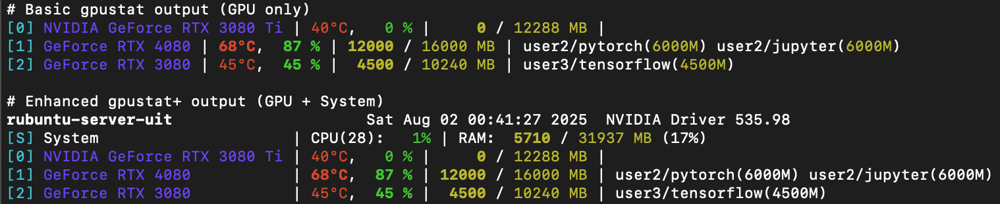

`gpustat+`
==========

[][pypi_gpustat]
[](LICENSE)

Enhanced GPU and system monitoring tool - now with CPU and RAM monitoring!



**gpustat+** is an enhanced version of the popular gpustat tool that not only monitors NVIDIA GPUs but also provides system-wide CPU and memory monitoring in the same unified interface.

## ✨ New Features in gpustat+

- **System CPU monitoring**: Display CPU utilization and core count
- **System RAM monitoring**: Show memory usage (used/total/percentage) 
- **Unified interface**: Monitor GPUs and system resources in one command
- **JSON support**: System information included in structured output
- **Backward compatible**: All original gpustat features preserved

NOTE: This works with NVIDIA Graphics Devices only, no AMD support as of now. Contributions are welcome!

Also works in combination with [gpustat-web][gpustat-web] for web-based monitoring.
To do so, just use the `--exec` option to run `gpustat+` command in the web server configuration instead of the original `gpustat` command. 

[gpustat]: https://github.com/wookayin/gpustat
[gpustat-web]: https://github.com/wookayin/gpustat-web


Installation
------------

### Ubuntu/Debian Package Installation (Recommended)

For Ubuntu/Debian systems, you can install using the pre-built package:

#### Prerequisites

First, install the required system packages:

```bash
# Update package list
sudo apt update

# Install required packages for building and Python dependencies
sudo apt install -y build-essential debhelper dh-python python3-all python3-setuptools python3-setuptools-scm python3-wheel devscripts 


# Install Python dependencies
pip3 install setuptools_scm
```

#### Option 1: Download and Install Package

```bash
# Download the latest release package
wget https://github.com/RobertoNeglia/gpustat-plus/releases/download/latest/gpustat-plus_*.deb

# Install the package
sudo dpkg -i gpustat-plus_*.deb

# Install dependencies if needed
sudo apt-get install -f
```

#### Option 2: Build from Source

```bash
# Clone the repository
git clone https://github.com/RobertoNeglia/gpustat-plus.git
cd gpustat-plus

# Build the package
make package
# or alternatively: ./build-ubuntu-package.sh

# Install the package
make install
# or alternatively: sudo dpkg -i ../gpustat-plus_*.deb
```

#### Post-Installation

After installing the Ubuntu package, both commands will be available:
- `/usr/bin/gpustat+` - Enhanced version with system monitoring
- `/usr/bin/gpustat` - Original command for backward compatibility

**Note:** The Ubuntu package automatically handles Python dependencies (psutil, blessed). The NVIDIA dependencies should already be installed from the prerequisites step above.

See [UBUNTU-PACKAGE.md](UBUNTU-PACKAGE.md) for detailed packaging instructions and troubleshooting.

### Direct Installation from Source

If you prefer to install directly from source without building a package:

```bash
# Install the latest version directly from GitHub
pip3 install git+https://github.com/RobertoNeglia/gpustat-plus.git@master

# Or clone and install in development mode
git clone https://github.com/RobertoNeglia/gpustat-plus.git
cd gpustat-plus
pip3 install -e .
```

This will install both commands:
- `gpustat+` - Enhanced version with system monitoring
- `gpustat` - Original command for backward compatibility


### NVIDIA Driver and `pynvml` Requirements

>[!IMPORTANT]
> **DO NOT:** `pip install pynvml`, nor include [`pynvml`][pypi_wrong] as a dependency in your python project. This will not work.
>
> Instead: `pip install nvidia-ml-py`. [nvidia-ml-py][pypi_pynvml] is NVIDIA's the official python binding for NVML.

- gpustat 1.2+: Requires `nvidia-ml-py >= 12.535.108` ([#161][gh-issue-161])
- gpustat 1.0+: Requires NVIDIA Driver **450.00** or higher and `nvidia-ml-py >= 11.450.129`.
- If your NVIDIA driver is too old, you can use older `gpustat` versions (`pip install gpustat<1.0`). See [#107][gh-issue-107] for more details.


### Python requirements

- gpustat<1.0: Compatible with python 2.7 and >=3.4
- gpustat 1.0: [Python >= 3.4][gh-issue-66]
- gpustat 1.1: Python >= 3.6


Usage
-----

`$ gpustat+`

## Enhanced Features

**System Monitoring** (NEW in gpustat+):
* `-s`, `--show-system` : Display system CPU and RAM usage alongside GPU information
* `-a`, `--show-all`    : Display all GPU properties AND system information

## Usage Examples

**Basic GPU monitoring:**
```bash
$ gpustat+
```

**GPU + System monitoring:**
```bash
$ gpustat+ --show-system
# or
$ gpustat+ -s
```

**Complete monitoring (everything):**
```bash
$ gpustat+ --show-all
```

**Real-time monitoring:**
```bash
$ gpustat+ --show-system --watch 2
```

**JSON output with system info:**
```bash
$ gpustat+ --show-system --json
```

## All Options

Options (Please see `gpustat+ --help` for more details):

* `--color`            : Force colored output (even when stdout is not a tty)
* `--no-color`         : Suppress colored output
* `-u`, `--show-user`  : Display username of the process owner
* `-c`, `--show-cmd`   : Display the process name
* `-f`, `--show-full-cmd`   : Display full command and cpu stats of running process
* `-p`, `--show-pid`   : Display PID of the process
* `-F`, `--show-fan`   : Display GPU fan speed
* `-e`, `--show-codec` : Display encoder and/or decoder utilization
* `-P`, `--show-power` : Display GPU power usage and/or limit (`draw` or `draw,limit`)
* **`-s`, `--show-system`** : **Display system CPU and RAM usage** ✨
* `-a`, `--show-all`   : Display all gpu properties above (now includes system info)
* `--id`              : Target and query specific GPUs only with the specified indices (e.g. `--id 0,1,2`)
* `--no-processes`    : Do not display process information (user, memory) ([#133][gh-issue-133])
* `--watch`, `-i`, `--interval`   : Run in watch mode (equivalent to `watch gpustat+`) if given. Denotes interval between updates.
* `--json`             : JSON Output (now includes system information when `--show-system` is used) ([#10][gh-issue-10])
* `--print-completion (bash|zsh|tcsh)` : Print a shell completion script. See [#131][gh-issue-131] for usage.


### Tips

- Try `gpustat+ --debug` if something goes wrong.
- To periodically watch, try `gpustat+ --watch` or `gpustat+ -i` ([#41][gh-issue-41]).
    - For older versions, one may use `watch --color -n1.0 gpustat+ --color`.
- Running `nvidia-smi daemon` (root privilege required) will make querying GPUs much **faster** and use less CPU ([#54][gh-issue-54]).
- The GPU ID (index) shown by `gpustat+` (and `nvidia-smi`) is PCI BUS ID,
  while CUDA uses a different ordering (assigns the fastest GPU with the lowest ID) by default.
  Therefore, in order to ensure CUDA and `gpustat+` use **same GPU index**,
  configure the `CUDA_DEVICE_ORDER` environment variable to `PCI_BUS_ID`
  (before setting `CUDA_VISIBLE_DEVICES` for your CUDA program):
  `export CUDA_DEVICE_ORDER=PCI_BUS_ID`.


Display Formats
---------------

### Default GPU display

```
[0] GeForce GTX Titan X | 77°C,  96 % | 11848 / 12287 MB | python/52046(11821M)
```

- `[0]`: GPU index (starts from 0) as PCI_BUS_ID
- `GeForce GTX Titan X`: GPU name
- `77°C`: GPU Temperature (in Celsius)
- `96 %`: GPU Utilization
- `11848 / 12287 MB`: GPU Memory Usage (Used / Total)
- `python/...`: Running processes on GPU, owner/cmdline/PID (and their GPU memory usage)

### Enhanced display with system monitoring (NEW)

```
hostname                     Fri Aug  1 21:49:00 2025  NVIDIA Driver 535.98
[S] System           | CPU(8):  36% |  5114 / 16384 MB (80%)
[0] GeForce RTX 4090 | 65°C,  85 % | 15000 / 24000 MB | user1(15000M)
[1] GeForce RTX 4080 | 68°C,  87 % | 12000 / 16000 MB | user2(6000M)
```

- `[S] System`: System information line
- `CPU(8): 36%`: CPU utilization percentage with core count
- `5114 / 16384 MB (80%)`: System RAM usage (Used / Total / Percentage)
- Color coding: Green/yellow for CPU, yellow/red for memory based on usage thresholds


[pypi_gpustat]: https://pypi.org/project/gpustat-plus/
[pypi_pynvml]: https://pypi.org/project/nvidia-ml-py/#history
[pypi_wrong]: https://pypi.org/project/pynvml/
[gh-issue-10]: https://github.com/wookayin/gpustat/issues/10
[gh-issue-41]: https://github.com/wookayin/gpustat/issues/41
[gh-issue-54]: https://github.com/wookayin/gpustat/issues/54
[gh-issue-66]: https://github.com/wookayin/gpustat/issues/66
[gh-issue-107]: https://github.com/wookayin/gpustat/issues/107
[gh-issue-131]: https://github.com/wookayin/gpustat/issues/131
[gh-issue-133]: https://github.com/wookayin/gpustat/issues/133
[gh-issue-161]: https://github.com/wookayin/gpustat/issues/161#issuecomment-1784007533

Default display
---------------

```
[0] GeForce GTX Titan X | 77°C,  96 % | 11848 / 12287 MB | python/52046(11821M)
```

- `[0]`: GPU index (starts from 0) as PCI_BUS_ID
- `GeForce GTX Titan X`: GPU name
- `77°C`: GPU Temperature (in Celsius)
- `96 %`: GPU Utilization
- `11848 / 12287 MB`: GPU Memory Usage (Used / Total)
- `python/...`: Running processes on GPU, owner/cmdline/PID (and their GPU memory usage)

Changelog
---------

See [CHANGELOG.md](CHANGELOG.md)


License
-------

[MIT License](LICENSE)
